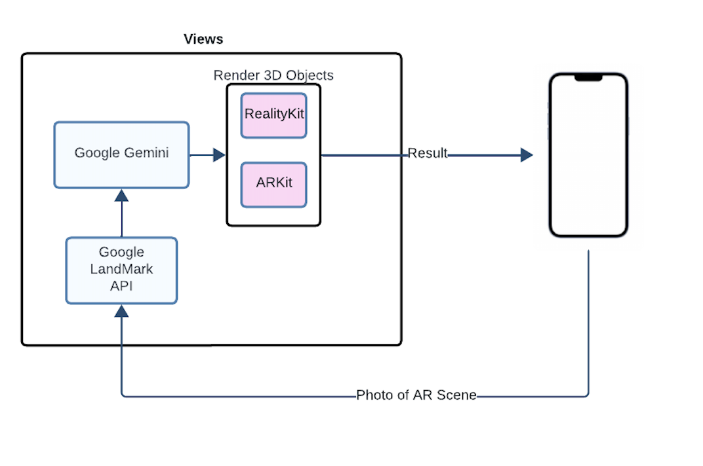

# Views Application

This application uses image recognition to detect landmarks and show facts about the landmark using Apple's ARKit/RealityKit.

Please see GitHub Repo Here: https://github.com/aniavetian/UWB-Views

## Repo Contents

1. `UWB-Views`
   - Contains the project to do landmark detection
   - Directions to running the app are in the "Running the App" section.

## Architecture

This architecture shows a photo of an AR scene going into the Views application. 
The Google Vision API will process the photo, giving back a landmark. 
This landmark will be fed into Google's Gemini ML model to get a fact about the landmark. 
The fact will then be processed by ARKit and RealityKit, Apple's frameworks for creating AR objects. 
These objects will then be displayed to the user as AR text.



## How To Use

The Views application allows a user to learn about landmarks through AR. 
A user will take a photo of a landmark and a fact about the landmark will show up in AR. 
A user can take another photo of the landmark for a different fact. 
A user can also take photos of different landmarks and the AR fact will reflect the landmark being shown.

Demo will be available soon.

## Technologies Used

1. Xcode - Version 15.0
   - ARKit - Version 6
   - RealityKit - Version 2
2. iOS Capable Device (iPhone) - iPhone 13 Max Pro
3. iOS Verion 17.3.1

## Pre-Requisites to Running App Locally

1. You will need a computer running MacOS as any of the technologies used can only be opened on MacOS computers.
2. You will only be able to run this application on an iOS device. It cannot be run on the Xcode simulator as it contains augmented reality.
3. You will need an iOS device with iOS 11 or later to run ARKit and your iOS device must have a A9 or later processor.
4. You will need an Apple developer account to run the application on your iOS device. This is seperate from an iCloud account.

## Running the App

1. Download the project and open on Xcode.
2. Follow [this guide](https://developer.apple.com/documentation/xcode/running-your-app-in-simulator-or-on-a-device) to set up development on your iOS device as you cannot run this app on the Xcode simulator.
3. Follow [this guide](https://developer.apple.com/documentation/arkit/verifying_device_support_and_user_permission#) to allow camera access for ARKit app to run.
4. Follow [this guide](https://cloud.google.com/vision/docs/detecting-landmarks) on setting up the Google Vision API. Under "Landmark Detection Requests" the setup is explained. You will need an API Key. This can be setup with these instructions.
5. Follow [this guide](https://ai.google.dev/gemini-api/docs/get-started/tutorial?lang=swift) on setting up for Gemini AI Model. You will need an API Key. This can be setup with the these instructions.
6. Replace the following variables within the `ContentView.swift` file with the API keys created
   ```
   let GOOGLE_API_KEY = ""
   let GEMINI_API_KEY = ""
   ```
8. On Xcode select your device to run the project on (Make sure your device is connected via a wire to your computer).
9. Click the "Run" button or do `CMD + R`.
10. Open the app on your iOS device and use.


#
